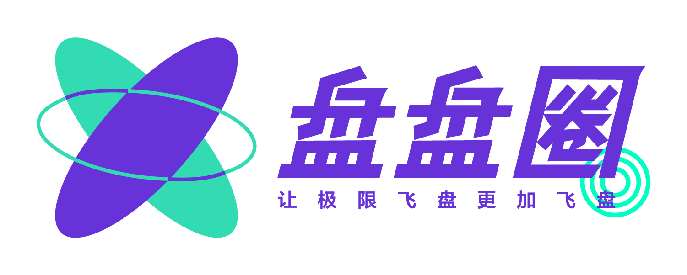
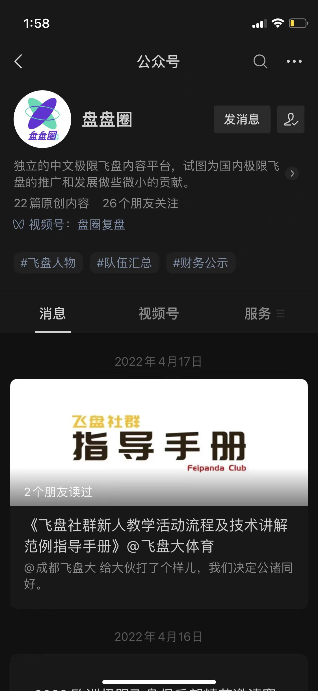

# 盘盘圈——飞盘地图

Hey～你好！“盘盘圈”（Pandonut）是由来自宁波 UFO 的 ```miao2```，来自同济 TJUF 极限飞盘队的```经林```、```juju```、```美惠```、```黑黑```，和来自华南理工大学的```桂宇```共同运营的独立极限飞盘内容平台。

<div align=center>
    
</div>

—— 我们经常会被问到 “*你们是什么机构？*”

—— **没有机构，我们只是我们。** 我们只是热爱极限飞盘，希望为国内极限飞盘的推广和发展做些微小贡献的普通人。


## 飞盘地图

这里是我们的网站：“盘盘圈——飞盘地图”

我们希望 ta 能帮助所有对飞盘感兴趣的人用最低的信息成本参与到飞盘运动中来，也希望居住地发生变化的盘友，能快速找到本地组织，重建生活的秩序。


<div align=center>
    
</div>

我们目前收集了```359```个由中国飞盘爱好者组成的海内外飞盘组织，包括```学校队伍```、```混合/公开队伍```、```女子队伍```、```青训队伍```。

如果您发现您的队伍或俱乐部没有出现在这个地图上，或者信息出现错误，抱歉是我们的疏忽，请前往[飞盘地图网站](http://www.pandonut.com/map)添加您的信息，或通过盘盘圈公众号联系我们。


这里有一些需要说明的事：

- 不是所有填写信息的飞盘组织都会出现在地图上

    首先我们必须进行一些初步筛选，去除信息不全或错误的组织。如果我们整理过程中出现了遗漏，说声抱歉，也希望您可以通过上面的方式联系我们。

- 感谢各位负责人和队长

    感谢所有支持我们的飞盘俱乐部负责人和队伍队长，非常感谢你们付出的时间，没有你们的帮助我们无法完成这个地图。

- 我们不是营销号，也不为盈利而生

    我们真真切切热爱飞盘，也希望中国飞盘可以越来越好，我们目的也很单纯，国内需要一份飞盘地图，那就可以由我们来做。所以，如果您发现这个地图上没有出现您所在的俱乐部或者社群，请麻烦进入[网站](http://www.pandonut.com/map)点击右上侧的信息添加填写信息，我们将以最快的速度将其体现到地图上。

- 我觉得这块不合理！
    
    我们接受任何意见，如果您有任何修改意见或者任何想法，欢迎给“盘盘圈”公众号后台留言或者微信添加 miao_42 反馈。我们希望听到各种声音。

## 更新记录

- 2022.05.09 盘盘圈全国非盘地图 2.0 正式发版！

## 支持我们

我们需要一定资金购买服务器和域名，如果我们帮到了您，可以考虑为我们捐一笔小小的资金 ⬇ 或者帮我们点一个小小的 Star 🌟

这些捐赠不会流入我们的口袋，我们会把 ta 们存入创作基金，用来支付网站、服务器、推广等所产生的成本，你也可以在公众号“盘盘圈”的标签栏点击 #财务公示 随时督查。

你的捐赠可以让我们更健康地生产内容和维护项目，非常感谢。


<div align=center>
    
</div>

## 关于我们

欢迎前往微信搜索公众号 “盘盘圈”，我们会持续更新优质内容

<div align=center>
    
</div>


“盘盘圈” 有三个正在进行的中等项目和几个正在进行的小项目：

两个中等项目：
- 更加关注 SOTG（Spirit of the Game） 的 —— “盘盘圈”小程序
- 更加注重赛场外飞盘故事的播客 ——《盘圈小电》
- 更加关心参与飞盘运动信息成本的 ——《飞盘地图》

几个小项目 ：

- 国内飞盘队伍分布表格
- 国内飞盘比赛分布表格（完成度 10% 计划年底完成）
- 国际飞盘比赛复盘视频（筹划度 100% 计划八月底出第一集）
- 盘圈通讯 Newsletter 计划（⚠️内有广告,小心）

**“盘盘圈”小程序** 主要以线上极限飞盘精神评分表为主体，涵盖飞盘规则、飞盘活动、《盘圈小电》等功能。我们希望通过小程序实现极限飞盘精神评分无纸化，同时借助小程序的便捷高效更好地促进极限飞盘运动发展。


**《盘圈小电》** 是一档主要面对极限飞盘玩家和对极限飞盘运动感兴趣群体的播客节目。我们热爱这项运动，也深知 ta 在国内还很小众。为了增加些许趣味性让更多人知晓或继续热爱这项运动，也为了丰富中文飞盘领域的内容，我们策划了这个不成熟的播客节目，目前已经完成了第一季的筹划。欢迎各位盘友对节目相关内容的批评指正。

如果你觉得我们的内容做得不错，欢迎在公众号上点赞、在看或转发支持我们，也欢迎各位给予我们资金上的支持，请在```“爱发电”```上支持我们或订阅```“盘圈通讯 Newsletter”计划```，具体的资助信息和规则请点击[《盘圈小电》第一届股东大会](https://mp.weixin.qq.com/s/VmH1Otl4a3bkeq1qX5FV1w)。

我们计划 22/23 年用爱发电，努力生产我们觉得好的飞盘内容，等内容达到我们定下的标准后再试着考虑商业化，欢迎 2023 年各位金主爸爸来聊。

正如公众号的名字“盘盘圈”想要表达的，我们希望所有热爱极限飞盘的玩家，所有参与或将要参与到极限飞盘运动中的朋友都能拥有一个属于极限飞盘的第三方内容平台。

我们始终相信飞盘是以人为枢纽的运动，希望我们的这个小项目能给各位带来一些飞盘认同感！也希望这个项目能延长你对飞盘的热爱！有机会我们场上见！